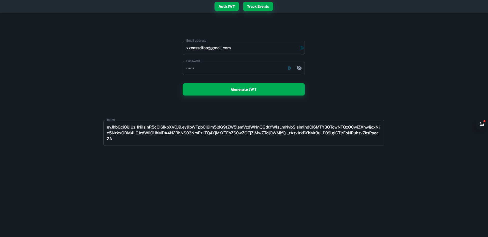
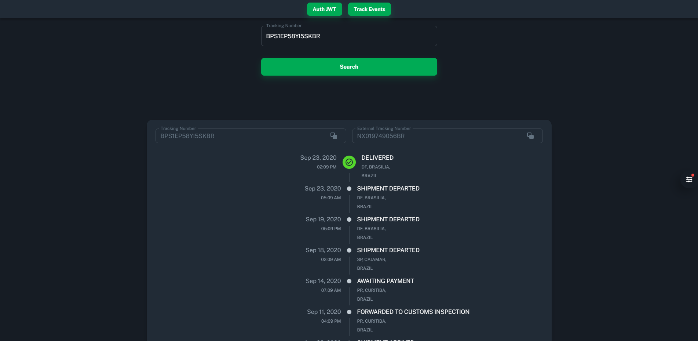

<p align="center">Web for Bringer Challenge.</p>
    <p align="center">
    
    
    <a href="https://github.com/pjavier98/bringer-challenge-api/commits/master">
        
    </a>
</p>
  <!--[](https://opencollective.com/nest#backer)
  [](https://opencollective.com/nest#sponsor)-->

## Description

Web app built for the Bringer challenge.

## Features

This app features all the latest tools in API development!

- **ReactJS**
- **Typescript**
- **ESlint/Prettier**
- **Axios**
- **React Query**
- **React Hook Form**
- **MUI Material UI**

## Installation

```bash
$ yarn install
```

## Running the app

```
1. Copy the .env.example file with the .env name and fill in the environment variables.
2. Run yarn start to run the project on the port specified in the environment variable named REACT_APP_API_URL
```

## Some images of the project




## License

Nest is [MIT licensed](LICENSE).
